+++
title = 'Hugo Forum Topic #49162'
linkTitle = 'Home'
date = 2024-04-04T07:04:53-07:00
draft = false
details = 'https://discourse.gohugo.io/t/49162'
description = "Mermaid problem with axisFormat %H:%M"
+++

````text

````

```mermaid
gantt
    title Test title
    dateFormat H:mm
    axisFormat %H:%M
    section Test
    test label     :2014-01-01 6:11, 20m
    second task    :2014-01-01 6:20, 20m
```


