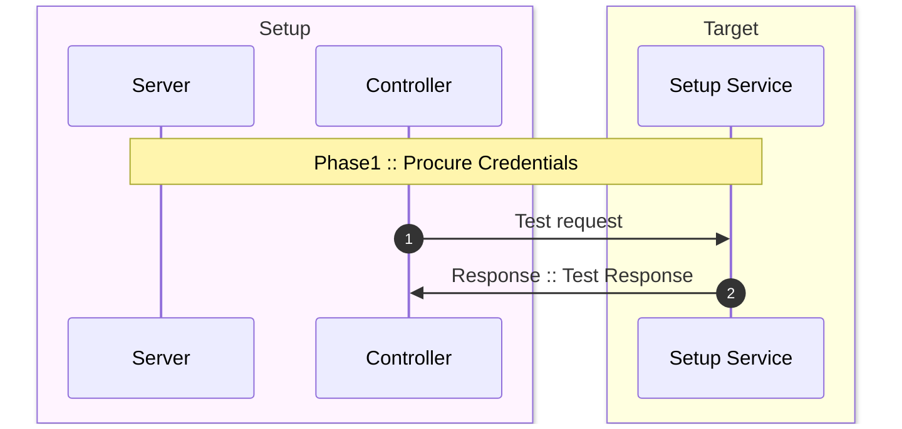

+++
title = 'Hugo Forum Topic #43967'
linkTitle = 'Home'
date = 2023-04-18T11:12:34-07:00
draft = false
details = 'https://discourse.gohugo.io/t/43967'
description = "Box in mermaid sequence in markdown does not render"
+++

