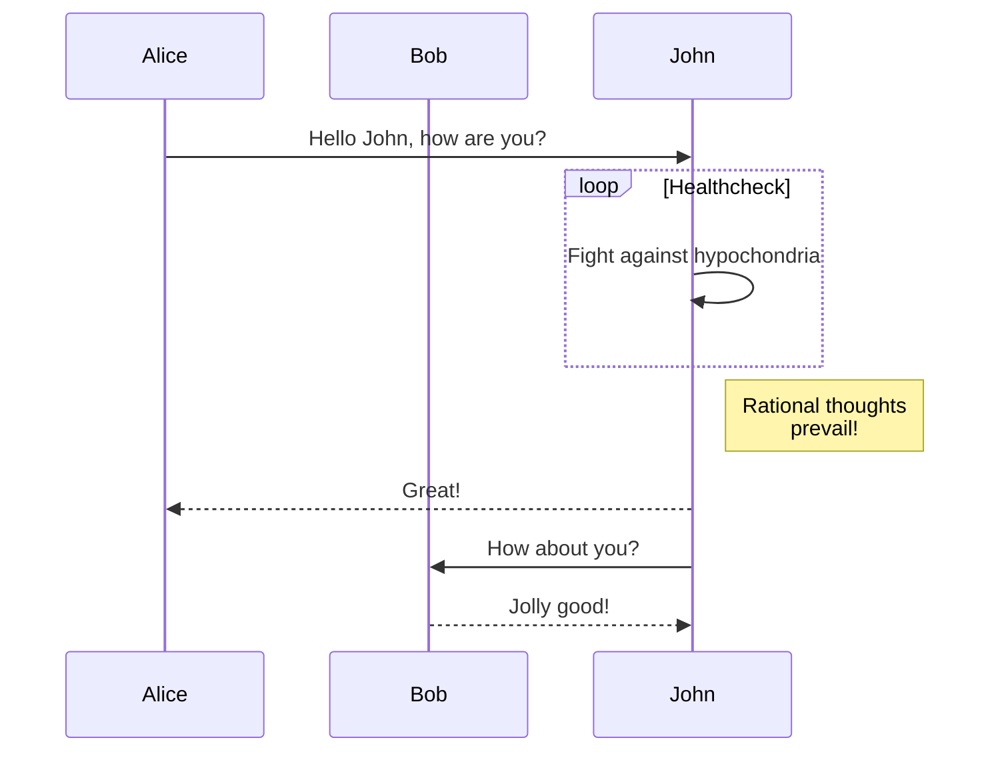

+++
title = 'Hugo Forum Topic #47662'
linkTitle = 'Home'
date = 2024-01-01T09:08:56-08:00
draft = false
details = 'https://discourse.gohugo.io/t/47662'
description = "How to insert mermaid diagram with the render hooks way?"
+++

