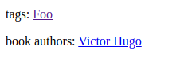

+++
title = 'Hugo GitHub Issue #13422'
linkTitle = 'Home'
date = 2025-03-16T09:50:53-07:00
draft = false
details = 'https://github.com/gohugoio/hugo/issues/13422'
description = "Term name includes plural taxonomy name as prefix"
tags = ['foo']
'book authors' = ['Victor Hugo']
+++

## Expected

## Actual
