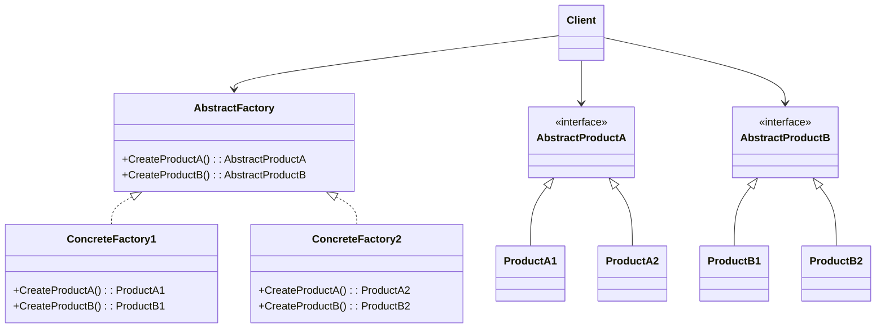
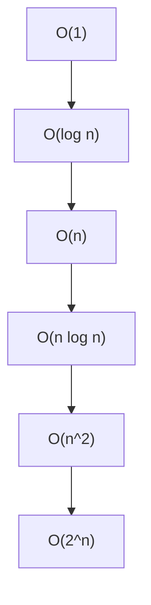
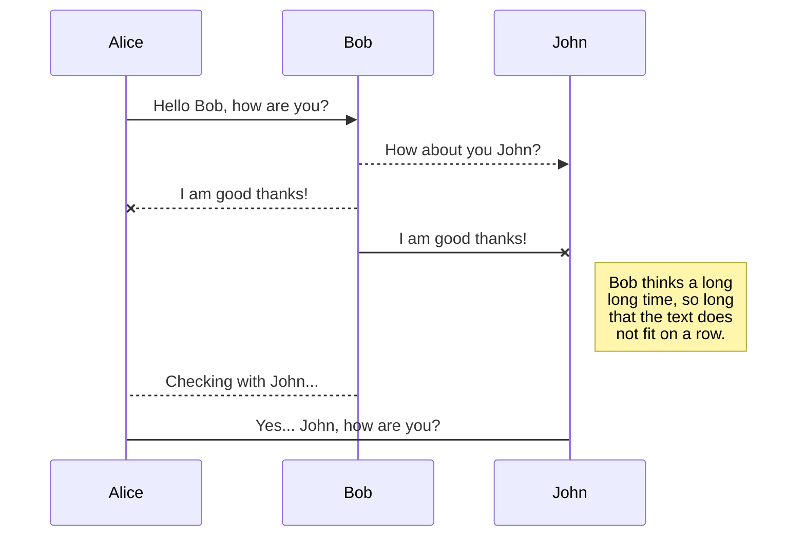
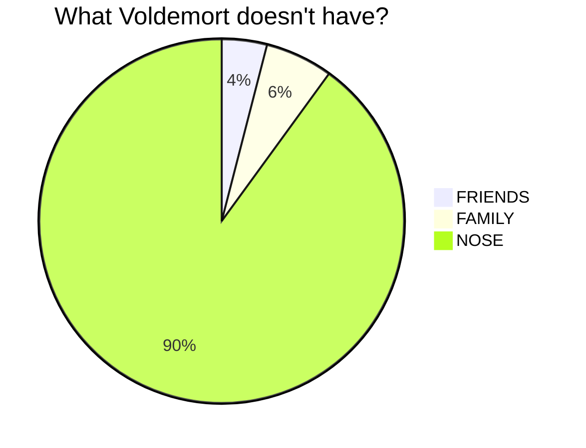
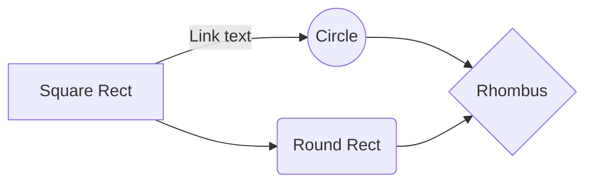
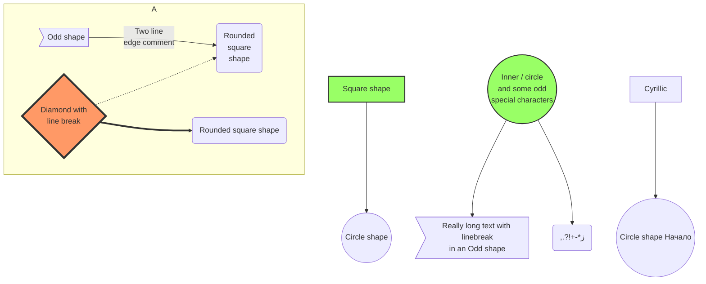
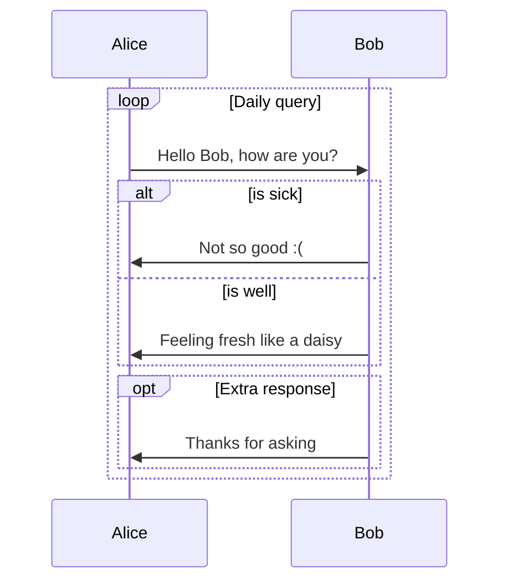
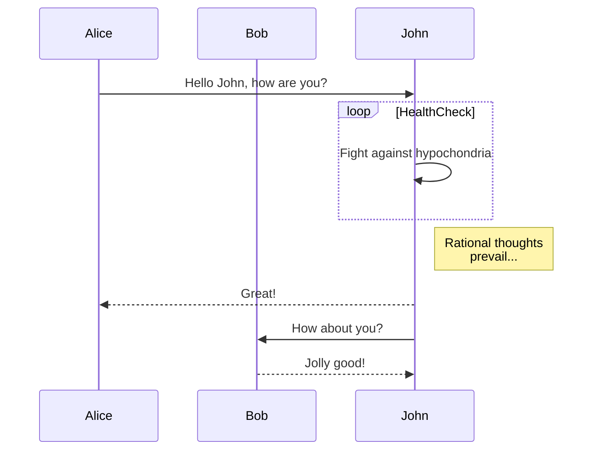
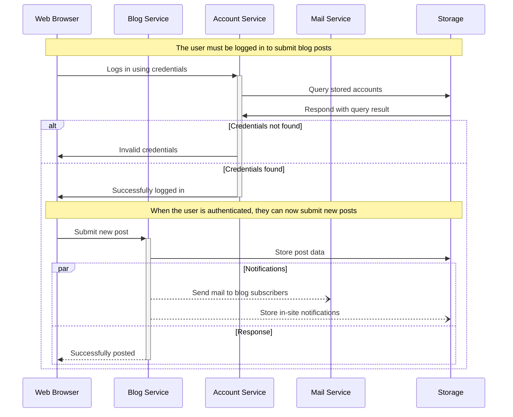
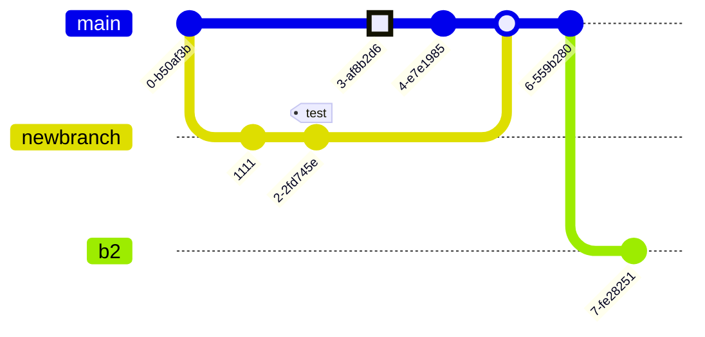

+++
title = 'Hugo Forum Topic #52506'
linkTitle = 'Home'
date = 2024-11-22T11:33:31-08:00
draft = false
details = 'https://discourse.gohugo.io/t/52506'
description = "Add support for `safe.Mermaid` ;)"
+++

## Example 1 (Hugo Forum Topic #52506)

```mermaid
classDiagram
    AbstractFactory <|.. ConcreteFactory1
    AbstractFactory <|.. ConcreteFactory2

    AbstractProductA <|-- ProductA1
    AbstractProductA <|-- ProductA2
    AbstractProductB <|-- ProductB1
    AbstractProductB <|-- ProductB2

    Client --> AbstractFactory
    Client --> AbstractProductA
    Client --> AbstractProductB

    class AbstractFactory {
        +CreateProductA() : AbstractProductA
        +CreateProductB() : AbstractProductB
    }

    class ConcreteFactory1 {
        +CreateProductA() : ProductA1
        +CreateProductB() : ProductB1
    }

    class ConcreteFactory2 {
        +CreateProductA() : ProductA2
        +CreateProductB() : ProductB2
    }

    class AbstractProductA {
        <<interface>>
    }

    class AbstractProductB {
        <<interface>>
    }

    class ProductA1
    class ProductA2
    class ProductB1
    class ProductB2
```

## Example 2 (Hugo Forum Topic #52506)

```mermaid
graph TD
    A["O(1)"] --> B["O(log n)"]
    B --> C["O(n)"]
    C --> D["O(n log n)"]
    D --> E["O(n^2)"]
    E --> F["O(2^n)"]
```

## Example 3

```mermaid
sequenceDiagram
    Alice ->> Bob: Hello Bob, how are you?
    Bob-->>John: How about you John?
    Bob--x Alice: I am good thanks!
    Bob-x John: I am good thanks!
    Note right of John: Bob thinks a long<br/>long time, so long<br/>that the text does<br/>not fit on a row.

    Bob-->Alice: Checking with John...
    Alice->John: Yes... John, how are you?
```

## Example 4

```mermaid
pie title What Voldemort doesn't have?
         "FRIENDS" : 2
         "FAMILY" : 3
         "NOSE" : 45
```

## Example 5

```mermaid
graph LR
    A[Square Rect] -- Link text --> B((Circle))
    A --> C(Round Rect)
    B --> D{Rhombus}
    C --> D
```

## Example 6

```mermaid
graph TB
    sq[Square shape] --> ci((Circle shape))

    subgraph A
        od>Odd shape]-- Two line<br/>edge comment --> ro
        di{Diamond with <br/> line break} -.-> ro(Rounded<br>square<br>shape)
        di==>ro2(Rounded square shape)
    end

    %% Notice that no text in shape are added here instead that is appended further down
    e --> od3>Really long text with linebreak<br>in an Odd shape]

    %% Comments after double percent signs
    e((Inner / circle<br>and some odd <br>special characters)) --> f(,.?!+-*ز)

    cyr[Cyrillic]-->cyr2((Circle shape Начало));

     classDef green fill:#9f6,stroke:#333,stroke-width:2px;
     classDef orange fill:#f96,stroke:#333,stroke-width:4px;
     class sq,e green
     class di orange
```

## Example 7

```mermaid
sequenceDiagram
    loop Daily query
        Alice->>Bob: Hello Bob, how are you?
        alt is sick
            Bob->>Alice: Not so good :(
        else is well
            Bob->>Alice: Feeling fresh like a daisy
        end

        opt Extra response
            Bob->>Alice: Thanks for asking
        end
    end
```

## Example 8

```mermaid
sequenceDiagram
    participant Alice
    participant Bob
    Alice->>John: Hello John, how are you?
    loop HealthCheck
        John->>John: Fight against hypochondria
    end
    Note right of John: Rational thoughts<br/>prevail...
    John-->>Alice: Great!
    John->>Bob: How about you?
    Bob-->>John: Jolly good!
```

## Example 9

```mermaid
sequenceDiagram
    participant web as Web Browser
    participant blog as Blog Service
    participant account as Account Service
    participant mail as Mail Service
    participant db as Storage

    Note over web,db: The user must be logged in to submit blog posts
    web->>+account: Logs in using credentials
    account->>db: Query stored accounts
    db->>account: Respond with query result

    alt Credentials not found
        account->>web: Invalid credentials
    else Credentials found
        account->>-web: Successfully logged in

        Note over web,db: When the user is authenticated, they can now submit new posts
        web->>+blog: Submit new post
        blog->>db: Store post data

        par Notifications
            blog--)mail: Send mail to blog subscribers
            blog--)db: Store in-site notifications
        and Response
            blog-->>-web: Successfully posted
        end
    end
```

## Example 10

```mermaid
gitGraph:
    commit "Ashish"
    branch newbranch
    checkout newbranch
    commit id:"1111"
    commit tag:"test"
    checkout main
    commit type: HIGHLIGHT
    commit
    merge newbranch
    commit
    branch b2
    commit
```
