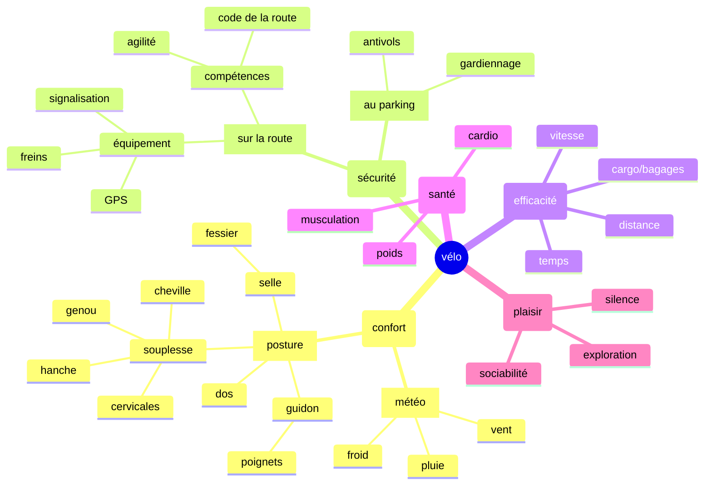

+++
title = 'Test 1'
date = 2023-09-14T18:11:08-07:00
draft = false
+++

```mermaid
mindmap
  Root((vélo))
    (confort)
    ::icon(fas fa-couch)
      [météo]
      ::icon(fas fa-cloud-sun-rain)
        froid
        pluie
        vent
      [posture]
      ::icon(fas fa-running)
        selle
          fessier
        guidon
          poignets
        souplesse
          cervicales
          hanche
          genou
          cheville
        dos
    (sécurité)
    ::icon(fas fa-exclamation-triangle)
      [sur la route]
      ::icon(fas fa-road)
        équipement
          freins
          signalisation
          GPS
        compétences
          code de la route
          agilité
      [au parking]
      ::icon(fas fa-parking)
        antivols
        gardiennage
    (efficacité)
    ::icon(fas fa-cogs)
      vitesse
      distance
      temps
      cargo/bagages
    (santé)
    ::icon(fas fa-heart)
      cardio
      musculation
      poids
    (plaisir)
    ::icon(fas fa-smile)
      exploration
      silence
      sociabilité
```
